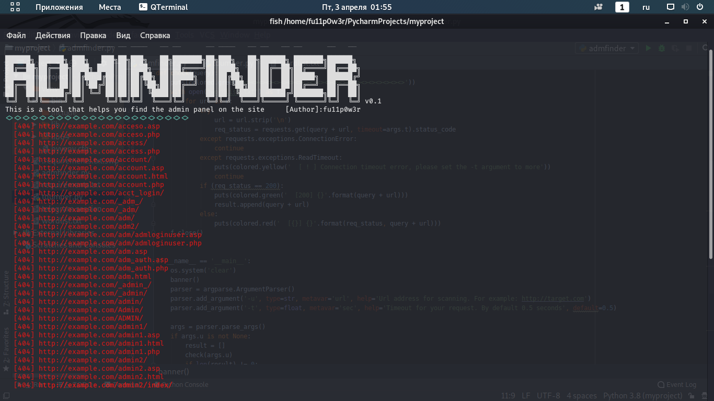

# adminfinder
​
The first version of a simple program that searches using the brute force admin panel on sites.
The program uses 3.* version of python, but maybe it will go to 2.* Try this :)

# How to start using
```
git clone https://github.com/fu11p0w3r/adminfinder
cd adminfinder
pip install -r requirements.txt
chmod +x adminfinder.py
python adminfinder.py
```

# CHANGE LOG
```
v0.2:
- Added new directories
- Completely rewritten with the addition of asynchrony in requests
```

# In future:
I want to add a proxy

If you have ideas what to add, I will be glad to hear.
Good luck :)
