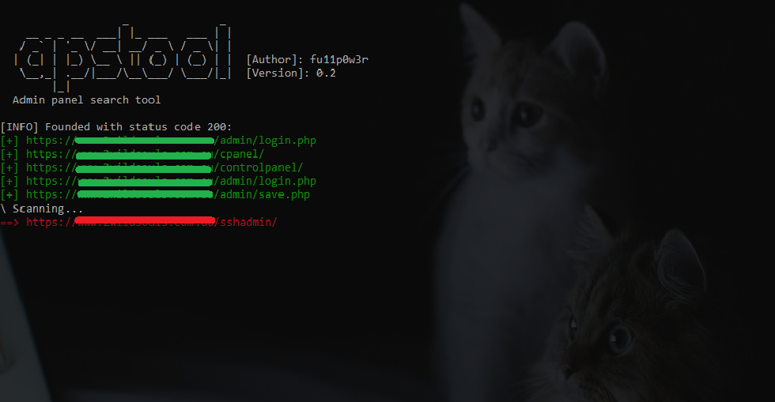

# APStool
​
APSTool - is a fast Admin Panel Search Tool written in Python.


# How to start using
For Linux users:
```
git clone https://github.com/fu11p0w3r/apstool
cd apstool
pip install -r requirements.txt
chmod +x apstool.py
python apstool.py
```
For Windows
```
Download
cd apstool
pip install -r requirements.txt
python apstool.py

```

# CHANGE LOG
```
v0.2:
- Added new directories
- Completely rewritten with asynchronous requests added. Scanning is now much faster
- Renamed from adminfinder to apstool
```

# In future:
Proxy support

If you have ideas what to add, I will be glad to hear.
Good luck :)
